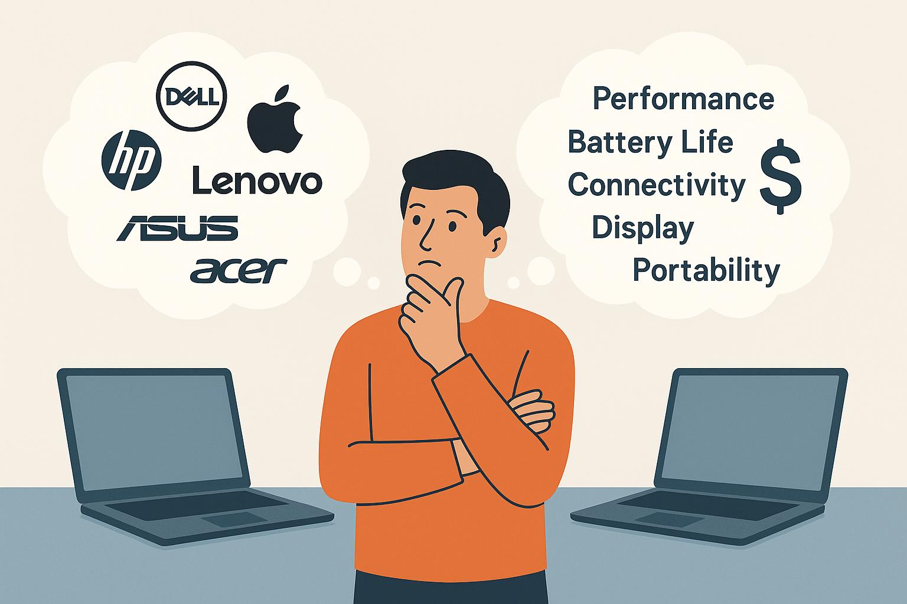
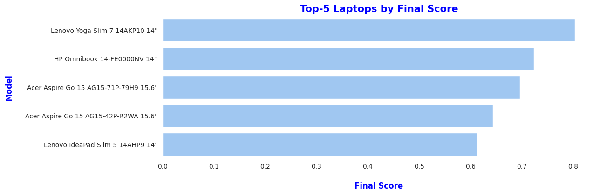

# Laptop Selection


This project implements a data-driven decision-making process for laptop selection using a **weighted-scoring method**.


It combines **real laptop specs** with **benchmark data** and converts them into a single comparable score.


---


## ⚙️ How It Works


1. **Data Collection**
- Specs are collected manually from **Public.gr** (Greek retailer) during Aug 2025.
- Only laptops that were **in stock** and **meet minimum requirements** are included.


2. **Feature Categories**
- **Quantitative**: CPU benchmark, RAM size, storage size, battery life, weight, price, connectivity (USB, HDMI etc).
- **Categorical**: Storage type (NVMe, SSD, UFS), RAM type (DDR4, DDR5, LPDDR5, LPDDR5X), Display panel (IPS, OLED, etc.), Display resolution (HD, FHD, QHD, 4K), Wireless technology and type, Webcam resolotion (720p -- 2160p).


3. **Normalization**
- Min-Max normalization is used to scale all features between 0 and 1.
- Cost-type features (like weight, price) are reversed so that **lower = better**.


4. **Weighted Score**
- Each feature is assigned a weight (chosen features sum to 1.0).
- Final score is calculated as a weighted sum of all normalized features.


5. **Ranking**
- Laptops are sorted by their final score.
- The top-ranked laptops are the best balance of performance, portability, and value.


---


## 📊 Visualization


The project includes a simple bar chart comparing the **Top-5 laptops by score**:





---


## 🛠 Usage


1. Collect raw laptop data into `laptop_data.csv`.
2. Run the pipeline:
```python
df = pd.read_csv('raw_data.csv')
df = data_transformation(df)
df = get_scores(df)
df = rank_laptops(df)
```
3. Review the ranked list and generate a chart.


---


## 📌 Notes
- Benchmarks are taken from **PassMark** (CPU).
- Features used can be adjusted depending on the users preferences.
- Weights can be adjusted depending on user needs (e.g. more focus on battery life or portability).
- This is a real world project and helps individuals to make a data-driven laptop choices yet it can be applied to any choices.


---


## 📷 Image Attribution
The project's image was generated by @DALL·E 3


<br><br><br>

&#x1F917; Thank you for visiting this project, and I hope it will help you make emotionless decisions &#128522;


